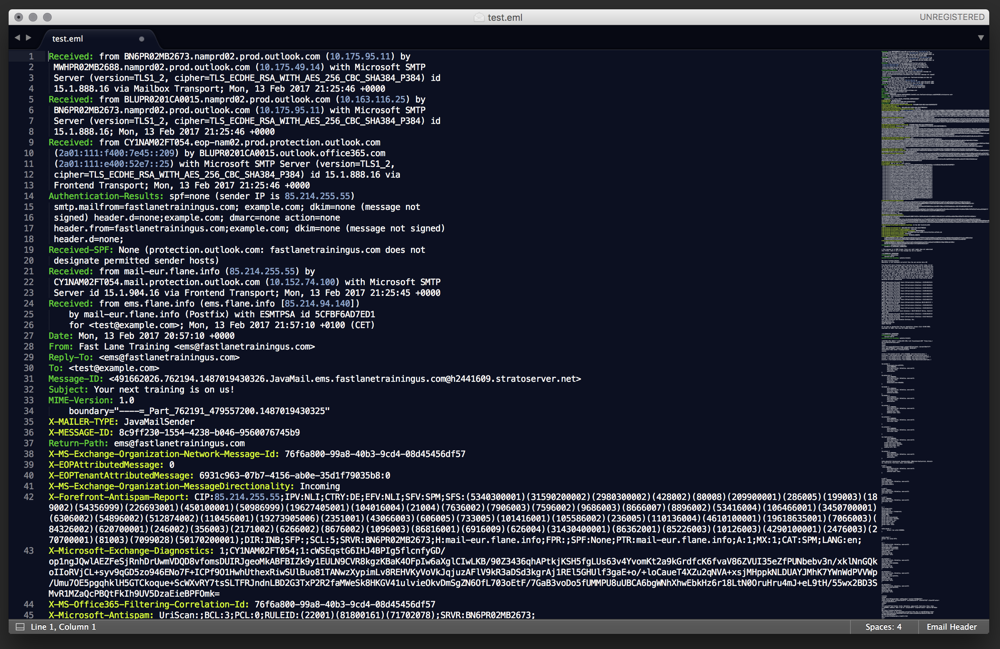

# EmailHeader
**This plugin will parse .eml or .msg files for email message headers, including x-headers, and will also color IPv4 and IPv6 addresses for ease of readability. Note: requires Sublime Text build 3092 or higher.**

## Manual Installation

Open Sublime Text 3 and navigate to **Preferences > Browse Packages…**
This should open the location on the file system under which Sublime Text 3 stores its packages.

Drop the “**EmailHeader.sublime-syntax**” within the "**User**" directory and the software should automatically add an “**Email Header**” syntax option in the lower right-hand corner. Any files with the **.eml** and **.msg** extensions will have this syntax definition automatically applied.
